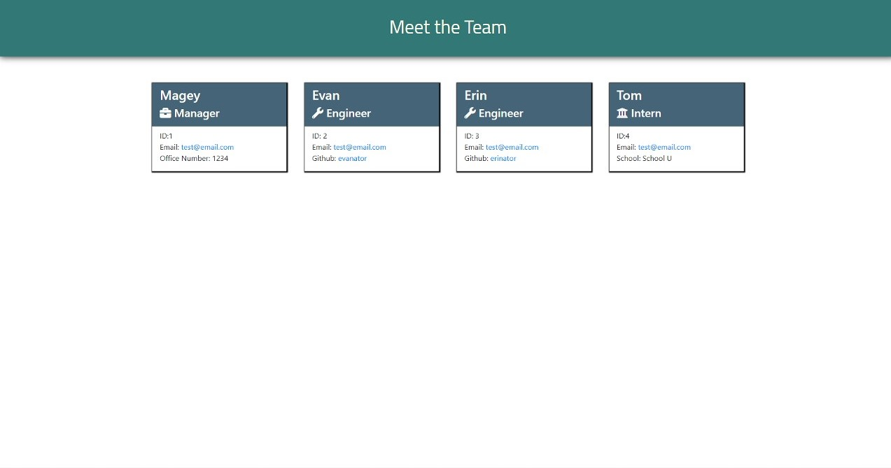

# TeamBuilding101

## Table of Contents
* [Description](#description)
* [Installation](#installation)
* [Usage](#usage)
* [Tests](#tests)
* [Questions](#questions)

## Description
This application presents the user with a series of prompts about their team members and outputs a styled HTML file based on their responses. The prompt will request information about the team manager followed by questions about any additional engineers or interns to be added to the team profile.

## Installation
To install this application, clone this repository into a folder of your choice.

## Usage
To generate the HTML for your team, run the app.js file in your command prompt or coding software by typing 'node app'. This will initiate the prompt. Navigate the choices by using arrow keys or number keys. The generated html will be outputted into the output folder which also contains the associated CSS file.   

A detailed video walkthrough can be found in the main directory of this repository.

## Tests
To run the tests for this application, change to the directory containing app.js using your command prompt or coding software. Type 'npm run test' to initiate the tests.

## Questions
Follow me on [Github](https://github.com/kayvonk).

To contact me, send an email to kayvonk@gmail.com with your name and inquiry.
